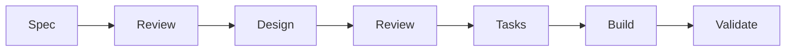

# Spec-Driven Development (SDD) Framework

> A robust, AI-native framework for high-velocity software engineering, prioritizing technical clarity and execution excellence.

This repository defines the core methodology, agents, and specialized skills that power a **Spec-Driven Development** workflow. By separating "what" from "how," and "how" from "implementation," we ensure that every line of code serves a verified purpose.

---

## 🚀 Core Methodology: The SDD Workflow

The framework follows a strict, sequential pipeline to minimize rework and maximize code quality:



1.  **Spec Phase**: Define requirements. (See [spec driven development.md](./spec%20driven%20development.md) and [example-spec.txt](./example-spec.txt))
2.  **Review Phase**: Rigorous validation of the Spec or Design.
3.  **Design Phase**: Technical architecture. (See [example-designmd.txt](./example-designmd.txt))
4.  **Tasks Phase**: Granular task breakdown. (See [creating-tasks.txt](./creating-tasks.txt))
5.  **Build Phase**: The actual coding phase, where features are implemented following the task list.
6.  **Validate Phase**: Ensuring the implementation meets all acceptance criteria.

---

## 🤖 AI Agents & Subagents

The framework utilizes a fleet of specialized subagents, each optimized for a specific phase of the SDD lifecycle:

| Agent | Role | Definition File |
| :--- | :--- | :--- |
| **Spec Specialist** | Feature Definition | [spec.md](./GEMINI%20CLI%20sub%20agents/agents/spec.md) |
| **Architect (Design)** | Technical Design | [design.md](./GEMINI%20CLI%20sub%20agents/agents/design.md) |
| **Task Decomposer** | Planning | [create-tasks.md](./GEMINI%20CLI%20sub%20agents/agents/create-tasks.md) |
| **Code Reviewer** | Quality Control | [code-reviewer.md](./GEMINI%20CLI%20sub%20agents/agents/code-reviewer.md) |
| **UI Designer** | Visual Excellence | [ui-designer.md](./GEMINI%20CLI%20sub%20agents/agents/ui-designer.md) |
| **Tech Expert** | Deep Research | [tech-expert.md](./GEMINI%20CLI%20sub%20agents/agents/tech-expert.md) |
| **TypeScript Pro** | Implementation | [typescript-pro.md](./GEMINI%20CLI%20sub%20agents/agents/typescript-pro.md) |
| **README Generator** | Documentation | [readme-generator.md](./GEMINI%20CLI%20sub%20agents/agents/readme-generator.md) |
| **Search Specialist** | Discovery | [search-specialist.md](./GEMINI%20CLI%20sub%20agents/agents/search-specialist.md) |

---

## 🛠️ Specialized Skills

Skills are bundled instruction sets and resources that extend agent capabilities:

*   **[`fallow`](./skills/fallow/SKILL.md)**: Static analysis for dead code and complexity management.
*   **[`vercel-react-best-practices`](./skills/vercel-react-best-practices/SKILL.md)**: Performance optimization for Next.js/React.
*   **[`write-a-skill`](./skills/write-a-skill/SKILL.md)**: The meta-skill for creating new capabilities.

---

## 🧠 Context Management

We maintain a multi-layered context system to ensure AI agents operate with consistent rules and philosophies:

*   **Global Context**: [AGENTS_MD/global/GEMINI.md](./AGENTS_MD/global/GEMINI.md) - System-wide rules for languages and standards.
*   **Project Context**: [AGENTS_MD/project/GEMINI.md](./AGENTS_MD/project/GEMINI.md) - Repository-specific guidelines and philosophies.
*   **Knowledge Items (KIs)**: Curated, localized knowledge about the repository to avoid redundant research and adhere to established patterns.

---

## 📐 Design Philosophy: "Fire Your Design Team"

Integrated into the design phase are premium aesthetic guidelines (tailored for shadcn/ui and Tailwind v4) defined in [DESIGN_GUIDELINES.md](./Fire%20Your%20Design%20Team/DESIGN_GUIDELINES.md):

*   **Typography**: Strictly **4 font sizes** and **2 weights** (Regular/Semibold) for maximum clarity.
*   **Grid System**: A rigorous **8pt grid** (all spacing divisible by 8 or 4).
*   **Color Distribution**: The **60/30/10 rule** (60% neutral, 30% complementary, 10% accent).
*   **Aesthetics**: Vibrant colors, glassmorphism, and modern typography (Inter, Outfit).

---

## ⌨️ How to Use

1.  **Initialize**: Pull latest from `main`, create a feature branch.
2.  **Spec**: Use the **Spec Specialist** agent (or `/spec` command) to define requirements.
3.  **Review**: Ask the AI to review the spec against edge cases.
4.  **Design**: Use the **Architect** agent to create `design.md`.
5.  **Tasks**: Use the **Task Decomposer** to generate a phased `tasks.md` with To-Dos.
6.  **Build**: Hand off tasks to implementation agents in chunks.
7.  **Validate**: Verify against the original acceptance criteria.
8.  **Ship**: Commit, Push, PR, Merge, and Delete branch.


## 📂 Repository Structure

```text
.
├── AGENTS_MD/               # Global and Project-level AI context/rules
├── Fire Your Design Team/   # Premium UI/UX design guidelines
├── GEMINI CLI sub agents/   # Specialized agent instructions (markdown)
├── skills/                  # Core skill definitions and resources
├── spec driven development.md # Detailed methodology documentation
└── ...                      # Example specs, designs, and task lists
```

---

*This framework is designed for developers who want to move faster while building higher-quality, more maintainable software.*
